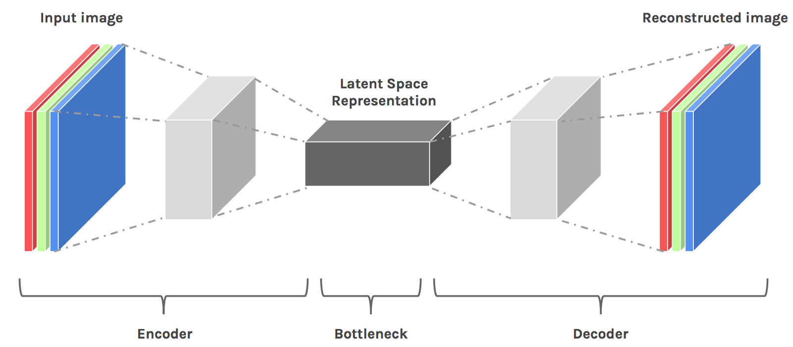
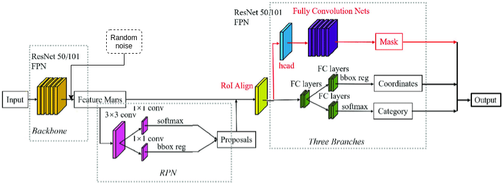
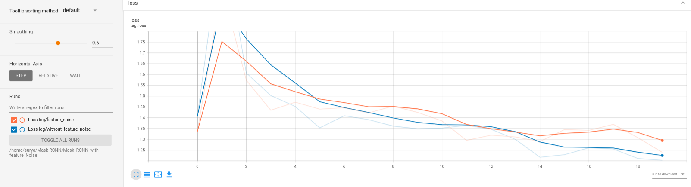

# **Mask RCNN with added Latent space noise**

**Packages used**

- `PyTorch`
- `Numpy`
- `PIL`
- `os`
- `TensorBoard`
- Sources codes from `torchvision/models` and `microsoft/computervision-recipes`

## List of Tasks

1.  Clone a state of art Mask RCNN implementation in PyTorch
2.  Download few samples from COCO dataset
3.  Add random noise to the latent space of the model (i.e prior to Regional Proposal Network)
4.  Train the model with noise and with out noise and compare the loss with charts

**Abstract about Latent space**

**Latent space** refers to an *abstract multi-dimensional space* containing feature values that we cannot interpret directly, but which encodes a meaningful internal representation of externally observed events. \[[source\]](https://stats.stackexchange.com/questions/442352/what-is-a-latent-space "Latent space")



The current implementation uses Resent-50 with FPN as a backbone which doesn't have decoder as show the above [figure](/home/surya/.config/joplin-desktop/resources/dc0d293602164cf49253b8930b50c9f8.png) but can be expressed as below 



## Task-1

To implement the a feature noise into backbone of the model I have choose following source code from [torchvision](https://github.com/pytorch/vision/tree/main/torchvision/models) and Microsoft's [computer vision](https://github.com/microsoft/computervision-recipes/tree/master/utils_cv/detection/references) repositories.

Cloned following source code classes and methods from `torchvision.models.detection`

```Python
mask_rcnn.py
    class MaskRCNN(FasterRCNN)
    Methods: maskrcnn_resnet50_fpn
backbone_utils.py
    class BackboneWithFPN(nn.Module)
    Methods: _resnet_fpn_extractor
         _validate_trainable_layers
```

Also from `torchvision.models`

```Python
resnet.py
    methods: resnet50(pretrained: bool = False, progress: bool = True, **kwargs: Any) -> ResNet:
```

From Microsoft's [computer vision](https://github.com/microsoft/computervision-recipes/tree/master/utils_cv/detection/references) repositories

```Python
coco_utils.py - For Loading COCO dataset
coco_eval.py
engine.py - For training the model
utils.py
```
## Task-2

Downloading the random `25` samples data using following snippet `data/download_dataset.py`

```Python
import fiftyone.zoo as foz
dataset = foz.load_zoo_dataset(
    "coco-2017",
    splits=["train", "validation", "test"],
    max_samples=25,
)
```

Datasets Hierarchy as follows 

```Text
data
│   download_dataset.py    
│
└───annotations
│   │   instances_train2017.json
│   │__ instances_val2017.json
│   
└───train
│   │	img____1.jpg
│   │__ img____2.jpg
└───val
    │   img____1.jpg
    │__ img____2.jpg
```

## Task-3

Implementation of random noise into the encoder latent space

For this task I have introduced a boolean `feature_noise` parameter in the following methods

```Python
model = Mask_RCNN.maskrcnn_resnet50_fpn(pretrained=True, use_feature_noise=False)
    .......

maskrcnn_resnet50_fpn(
    pretrained=False, 
    progress=True, 
    num_classes=91, 
    pretrained_backbone=True, 
    trainable_backbone_layers=None,
    use_feature_noise: bool = False, **kwargs):
    	......

 _resnet_fpn_extractor(
 	backbone: resnet.ResNet,
    	trainable_layers: int,
    	use_feature_noise: bool,
    	returned_layers: Optional[List[int]] = None,
    	extra_blocks: Optional[ExtraFPNBlock] = None,) -> BackboneWithFPN:
    	......
```

At last implemented Random noise at last layer of the backbone network using `torch.FloatTensor(shape._uniform())` in `backbone.py`

```Python
def forward(self, x: Tensor) -> Dict[str, Tensor]:
        x = self.body(x)
        if self.use_feature_noise:
            # Ordered dict here so final key is last layer
            last_layer = list(x.keys())[-1]
            self.noise = torch.FloatTensor(x[last_layer].size()[2:]).uniform_(0.8, 1.2).to("cuda")
            
            if self.training:
                x[last_layer] = x[last_layer] * self.noise
        
        x = self.fpn(x)
        return x
```

## Task-4

Training and evaluate the model with feature noise `use_feature_noise = True`

```Python
for epoch in range(epoch, num_epochs):
        train_one_epoch(model, optimiser, dataloaders["train"], device, epoch, writer, print_freq=1, use_feature_noise=False)
        evaluate(model, dataloaders["val"], device, epoch, use_feature_noise=False, writer=writer)
```

Comparing the losses of the models with latent noise and with out latent noise


